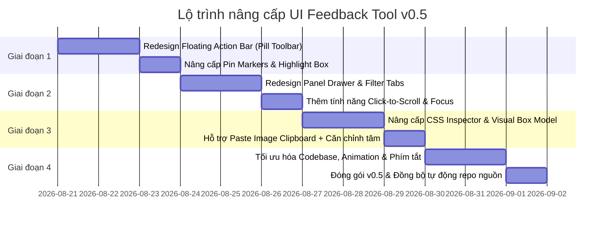

# 📋 KẾ HOẠCH NÂNG CẤP & CẢI TIẾN TOÀN DIỆN: UI FEEDBACK TOOL (v0.5)

> **Mục tiêu**: Nâng cấp công cụ ghi nhận feedback UI/UX trực tiếp trên trình duyệt đạt chuẩn **Design Tooling UI/UX** chuyên nghiệp (tương tự trải nghiệm của Figma / Linear / Vercel Toolbar), thao tác trực quan, giao diện sang trọng, mượt mà và tối ưu hóa hiệu năng.

---

## 1. TỔNG QUAN HIỆN TRẠNG (v0.4)

- **Source**: Single-file ES module (`ui-feedback.js` ~2,480 lines / 110KB).
- **Kiến trúc**: Web Component chạy trong **Shadow DOM**, hoàn toàn không bị ảnh hưởng hay gây đè CSS lên website host.
- **Tính năng hiện hữu**:
  - Phím tắt kích hoạt ngầm: `Q + W + E` (hoặc cấu hình tùy chọn).
  - 5 chế độ: **Comment** (ghi chú), **Edit** (sửa text trực tiếp), **Bộ giao diện** (tweak CSS inline), **Thay ảnh** (upload/URL + căn vị trí), **Undo** (hoàn tác thao tác).
  - Tích hợp lưu trữ: `localStorage` theo session/project.
  - Xuất dữ liệu: Xuất báo cáo Markdown + Tạo GitHub Issue 1-click.

---

## 2. PHÂN TÍCH ĐIỂM NGHẼN UI/UX & KỸ THUẬT

### 2.1. Trải nghiệm người dùng (UX Issues)
| Vấn đề | Hiện trạng (v0.4) | Đề xuất giải pháp (v0.5) |
| :--- | :--- | :--- |
| **Toolbar** | Cột dọc 6 icon tròn đen giống hệt nhau, không có nhãn text, khó nhớ tính năng. | Chuyển thành **Floating Action Bar (Pill ngang)** dạng dock bottom/floating, có icon + text label rõ ràng, tự collapse khi không dùng. |
| **Panel Danh sách** | Header màu vàng accent quá gắt, chữ quá nhiều thông số gây ngợp thị giác (*cognitive overload*). | Redesign theo dạng **Drawer / Slide-in Sheet**, header tinh gọn, phân tab rõ ràng (`Tất cả` / `Chưa xử lý` / `Đã xong` / `Chỉnh sửa`). |
| **Modal tương tác** | Dùng chung 1 kích thước modal (430px) cho cả nhập comment đơn giản lẫn chỉnh sửa CSS nâng cao. | **Tách ngữ cảnh**: Comment/Edit dùng Mini Popover; CSS/Image dùng Side Inspector chuyên dụng (520px hoặc Bottom Sheet). |
| **Marker trên trang** | Dùng ký tự Unicode nhỏ (✎, ✦, ▧) khó nhìn ở size 22px. | Thiết kế lại **Interactive Pin Markers** với micro-pulse animation, hover preview popover và màu sắc chuẩn hóa theo type. |
| **Onboarding** | Người dùng mở lần đầu không biết bắt đầu từ đâu. | Thêm **Quick Coachmark / Hint 3 bước** hiển thị 1 lần duy nhất khi lần đầu bật tool. |

### 2.2. Kỹ thuật & Hiệu năng (Code Quality)
- **DOM Rendering**: Hiện tại hàm `renderToolbar()`, `renderPanel()` dùng `innerHTML` ghi đè toàn bộ DOM khi state thay đổi, làm mất trạng thái focus và ngắt quãng animation. -> **Cần chuyển sang Virtual/Fine-grained DOM update**.
- **Tách module nội bộ**: Tách cấu trúc CSS và các module handler bên trong file theo IIFE logic để dễ bảo trì, thêm unit test/typing JSDoc đầy đủ.

---

## 3. PHƯƠNG ÁN NÂNG CẤP CHI TIẾT (DESIGN SPECIFICATIONS)

### 🎨 Phase 1: Redesign Floating Action Bar (Toolbar)

Thay thế toolbar dọc thành **Floating Dock Bar** sang trọng với hiệu ứng Glassmorphism (`backdrop-filter: blur(16px)`):

```
┌────────────────────────────────────────────────────────────────────────────────────────┐
│  ⠿ Grip  │  📋 Feedback (3)  │  💬 Note  │  ✏️ Sửa Text  │  🎨 Bộ CSS  │  🖼 Thay Ảnh  │  ↩ Hoàn tác (1)  │  ✕  │
└────────────────────────────────────────────────────────────────────────────────────────┘
```

- **Cấu trúc nút**: Icon SVG sắc nét + Label tiếng Việt/Anh trực quan.
- **Trạng thái Active**: Đường underline accent thanh lịch (màu vàng gold `#c9a866` hoặc accent chỉ định) thay vì phủ màu toàn nút.
- **Tính năng thu gọn**: Double click hoặc bấm nút Collapse để thu gọn thành **Floating Bubble icon** nhỏ ở góc màn hình.
- **Kéo thả linh hoạt**: Kéo thả tự do theo 4 góc/cạnh màn hình với snap tự động vào mép gần nhất.

---

### 📑 Phase 2: Redesign Drawer & Comment Card

#### A. Drawer Layout
- **Header**: Thiết kế tối giản, gồm tiêu đề + Badge đếm số lượng + Nút Tìm kiếm nhanh + Nút Xuất Markdown / GitHub Issue.
- **Segmented Tabs**:
  - `Tất cả` (All)
  - `💬 Ghi chú` (Open Feedback)
  - `✏️ Đã chỉnh sửa` (Edits & CSS)
  - `✓ Đã giải quyết` (Resolved)

#### B. Thẻ Feedback Item (Card Component)
```
┌───────────────────────────────────────────────────────────┐
│ 🔴 Cao   💬 [Bố cục]   📱 1920x1080 · 2 phút trước       │
│ 🎯 section#hero > div.container > h1.title                │
│                                                           │
│ "Cần tăng khoảng cách giữa tiêu đề và nút CTA thêm 16px" │
│                                                           │
│ ───────────────────────────────────────────────────────── │
│ [✓ Đánh dấu xong]        [✎ Sửa]        [🗑️ Xóa]          │
└───────────────────────────────────────────────────────────┘
```
- **Priority Indicator**: Đường viền màu ở mép trái (Đỏ: Cao, Vàng: Trung bình, Xanh: Thấp).
- **Code Line & Selector**: Rút gọn, hover để xem tooltip đầy đủ, bấm để copy nhanh selector.
- **Click to Focus**: Bấm vào bất kỳ thẻ nào trong danh sách sẽ tự động cuộn (scroll) trang đến đúng element đó và nhấp nháy highlight.

---

### 🛠️ Phase 3: Nâng cấp Bộ Giao Diện (CSS Inspector) & Thay Ảnh

#### A. Visual CSS Inspector (Side Panel 520px)
- **Live Preview Real-time**: Khi rê chuột chỉnh màu/padding/border-radius, element trên trang cập nhật tức thì 60fps.
- **Visual Box-Model Editor**: Mô hình trực quan hình hộp chữ nhật để chỉnh nhanh `margin` và `padding` từng chiều (Top, Right, Bottom, Left).
- **Color Picker cao cấp**: Hỗ trợ dải màu HEX, RGB, HSL + bảng màu Brand Palette trích xuất tự động từ website.
- **Before/After Split Switch**: Công tắc so sánh giao diện cũ và mới trước khi lưu.

#### B. Smart Image Switcher
- **Hỗ trợ Paste Clipboard (`Ctrl + V`)**: Copy ảnh từ bất kỳ đâu (Figma, chụp màn hình) và paste trực tiếp vào tool mà không cần lưu file ra máy.
- **Tùy chỉnh Khung hiển thị**: Chọn nhanh `object-fit: cover | contain | fill` và thanh kéo-thả vị trí tâm ảnh trực quan.
- **Nén ảnh tự động**: Tự động giảm dung lượng ảnh base64 dưới 800KB để chống tràn `localStorage`.

---

### ✨ Phase 4: Micro-interactions, Keyboard & Polish

1. **Quick Tagging Phím tắt nhanh**:
   - Khi đang rê chuột vào element (Pick mode), nhấn:
     - `T` -> Gán nhanh tag **Typography / Font chữ**
     - `C` -> Gán nhanh tag **Color / Màu sắc**
     - `S` -> Gán nhanh tag **Spacing / Khoảng cách**
     - `L` -> Gán nhanh tag **Layout / Bố cục**
2. **Interactive Pin Markers trên trang**:
   - Marker hình giọt nước / pill số thứ tự gắn chuẩn xác trên phần tử.
   - Click vào marker trên trang để mở popup chỉnh sửa nhanh nội dung.
3. **Sound & Haptics (Tùy chọn)**:
   - Âm thanh "click" nhẹ nhàng khi chụp feedback / lưu thành công (có toggle tắt/bật trong settings).

---

## 4. LỘ TRÌNH TRIỂN KHAI (ROADMAP)



---

## 5. HƯỚNG DẪN ĐỒNG BỘ DỰ ÁN

Khi cập nhật mã nguồn tool mới:
1. Đẩy code cập nhật lên repository canonical: `https://github.com/Ngh1aa/ui-feedback-tool`.
2. Workflow GitHub Actions `.github/workflows/sync-ui-feedback.yml` sẽ tự động kích hoạt và đồng bộ phiên bản mới nhất về project **Capital** (và tất cả dự án khác trong hệ sinh thái) mà không cần can thiệp thủ công.
